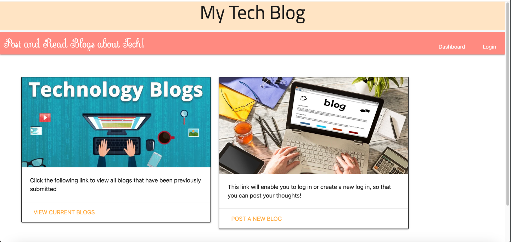
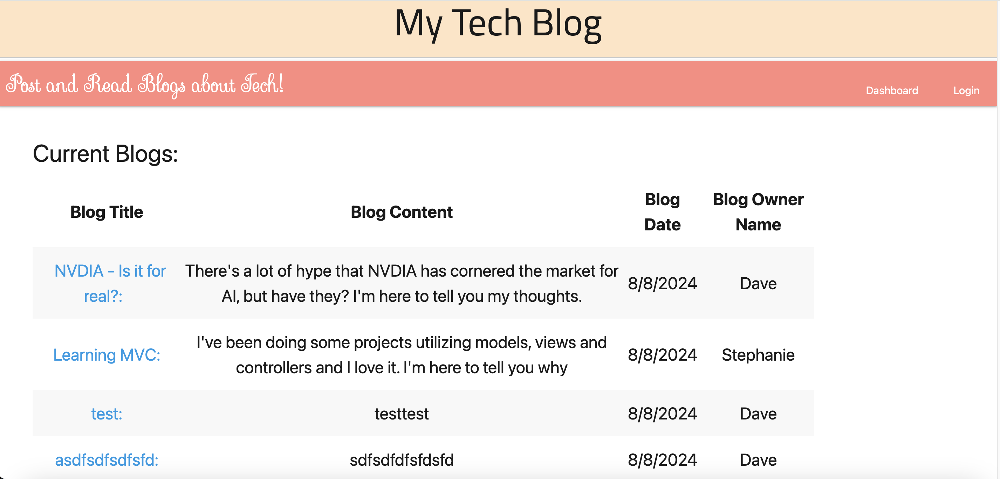
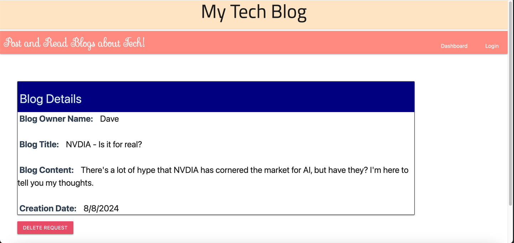
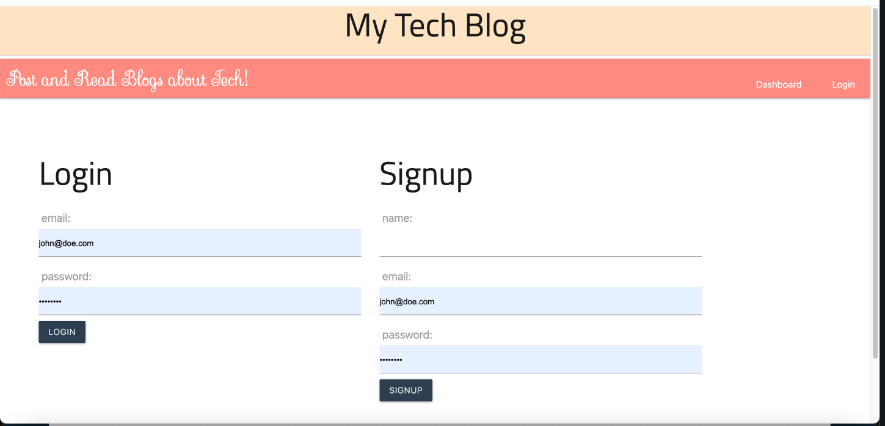

  # MVC Tech Blog

  

  ## Description
  An application that allows you to write, view, delete and comment on tech blogs. This app is built using Models Views and Controllers and utilizes Handlebars, express.js, node.js and sequelize

  ## URL of Deployed Application

  [MVC Tech Blog on Render](https://mvc-tech-blog-ngz3.onrender.com)

  ## Screenshots of Deployed Application

  

  

  

  

  ## Table of Contents
  - [Installation](#installation)
  - [Usage](#usage)
  - [Contributing](#contributing)
  - [Tests](#tests)
  - [Technologies](#technologies)
  - [License](#license)
  - [Questions](#questions)

  ## Installation
  No installation required. Simply visit the URL and start to click away!

  ## Usage
  This app is for users of technology that wants to share ideas as well as learn more about what others ahave to say about technology

  ## Contributing
  N/A

  ## Tests
  N/A

  ## Technologies
  

   ## License
  MIT

  ## Questions

  For any additional questions or feedback, please contact me with the following information:
  Github: (https://github.com/tjmcd2010)
  Email: (mailto:tjmcd2010@gmail.com)  

